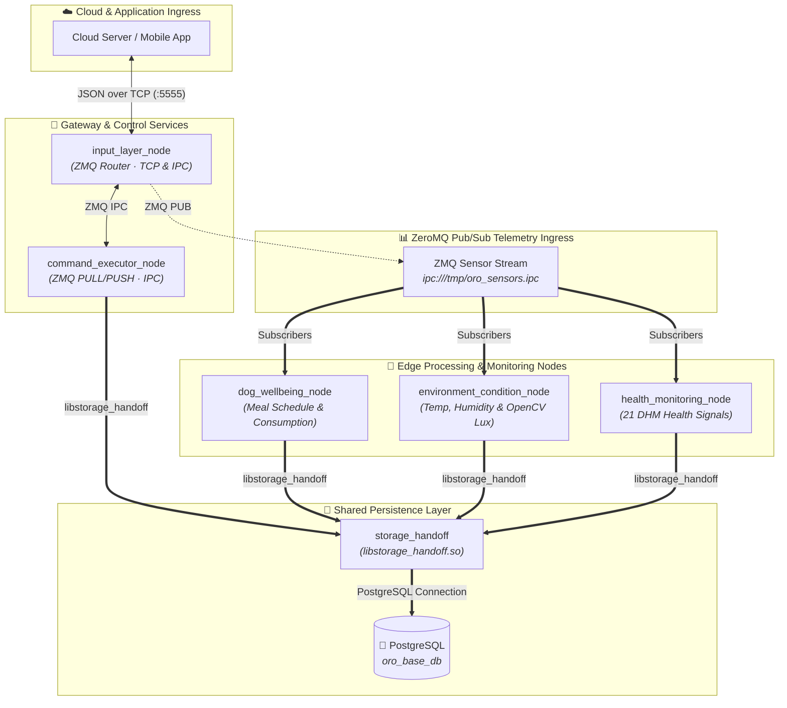

# ORo Base Edge Layer

> High-performance, modular C++17 edge services and middleware for the ORo Base smart canine companion.

The **ORo Base Edge Layer** runs on the Radxa Single Board Computer (SBC) as a suite of decoupled, lightweight `systemd` services. Together, they handle ingress command execution, real-time telemetry processing, canine well-being monitoring, ambient environmental tracking, and system health diagnostics—persisting all critical data locally using a high-efficiency PostgreSQL database.

---

## 🏗️ Edge Layer System Architecture

The following block diagram illustrates the communication, control flow, and data persistence topology within the ORo Base Edge Layer. All monitoring nodes and the command execution engine communicate over IPC sockets using ZeroMQ (ZMQ) and share a centralized C++ database writer (`libstorage_handoff`).



> [!NOTE]
> All core C++17 nodes in the edge layer utilize the `storage_handoff` shared library to interact with the PostgreSQL database. This ensures database queries are kept modular, optimized, and connection limits are handled gracefully with automatic throttling and reconnection rules.

---

## 📂 Directory Structure

```
oro_base_edge_layer/
├── README.md                      # This Edge Layer overview document
│
├── command_executor/              # Lightweight ZMQ command execution engine
├── config/                        # Centralized JSON configuration definitions
├── dog_wellbeing_node/            # Canine well-being (food/water) tracking node
├── environment_condition_node/    # Ambient room & light estimation node
├── health_monitoring_node/        # 21-signal system diagnostic node
└── storage_handoff/               # Shared pqxx C++ Postgres write utility library
```

---

## 📦 Components and Packages

### 1. [Command Executor](./command_executor)
* **Type**: C++17 `systemd` Service
* **Key Library Links**: `libzmq`, `nlohmann-json`
* **Purpose**: Serves as the validated ingress layer for server-initiated control instructions, replacing heavyweight task-scheduling systems. It parses inbound JSON-formatted signals, validates authority and uniqueness, enqueues them in a thread-safe FIFO pipeline, dispatches requests to dedicated hardware handlers (e.g., lid open/close, dispense treats), and publishes asynchronous results back to the server.
* **Reference**: For build guides, API specifications, and database structures, see the [Command Executor README](./command_executor/README.md).

### 2. Config Directory (`config`)
* **Type**: Configuration Module
* **Purpose**: Contains the central JSON configuration for all edge components (`oro_base_edge_layer_config.json`). Rather than hardcoding settings across individual nodes, this unified config defines:
  * **Global**: Unique device identifiers and central PostgreSQL connection parameters.
  * **Meal Schedules**: Multi-meal feeding time-windows (Breakfast, Lunch, Dinner) matching specific bowl IDs and targeted feed amounts.
  * **Environment thresholds**: Expected temperature and humidity comfort margins.
  * **Ambient Light Estimator**: Camera device routes and lux conversion formulas.
  * **Node Tick Intervals**: Telemetry sampling and heartbeat frequencies.

### 3. Dog Wellbeing Node (`dog_wellbeing_node`)
* **Type**: C++17 Executable Node
* **Key Library Links**: `libzmq`, `nlohmann-json`, `libstorage_handoff`
* **Purpose**: Tracks canine behavior and nourishment patterns. By subscribing to the ZMQ sensor stream, it processes bowl weights and water level data to dynamically:
  * Detect food consumption start, end, and quantity ingested.
  * Evaluate drinking events, calculating daily water intake.
  * Emit warning signals if water levels fall below target capacities or if scheduled meals are missed.
  * Periodically flush behavioral metrics directly to PostgreSQL.

### 4. Environment Condition Node (`environment_condition_node`)
* **Type**: C++17 Executable Node
* **Key Library Links**: `OpenCV`, `libzmq`, `nlohmann-json`, `libstorage_handoff`
* **Purpose**: Performs high-fidelity room diagnostic sensing. In addition to subscribing to temperature and humidity telemetry over ZMQ, it runs a production-grade visual sensing pipeline:
  * Captures raw frames from an onboard camera device (defaulting to `/dev/video13`).
  * Implements an **Ambient Light Estimator** algorithm using percentile brightness and Exponential Moving Average (EMA) filtering to calculate light in lux.
  * Categorizes light conditions (e.g., Dark, Dim, Normal, Bright).
  * Writes periodic ambient metrics and crossing warnings directly to the database.

### 5. Health Monitoring Node (`health_monitoring_node`)
* **Type**: C++17 Executable Node
* **Key Library Links**: `libzmq`, `libstorage_handoff`
* **Purpose**: Manages system reliability and diagnostics. It collects and validates **21 Diagnostic Health Monitoring (DHM)** signals, covering:
  * Heartbeat diagnostics (for both the host node and low-level MCU).
  * Peripheral health (camera obstructions, video frame quality, sensor bus failures).
  * Power status (battery percentages, low charge warnings, mains charging switches).
  * Software updates (firmware version snapshots, availability flags, progress logs, completion events).
* **Reference**: Documentation and structural breakdowns can be found in the accompanying package PDF (`Health Monitoring Node.pdf`).

### 6. [Storage Handoff](./storage_handoff)
* **Type**: C++17 Shared Library (`libstorage_handoff.so`)
* **Key Library Links**: `libpqxx` (Official PostgreSQL C++ Driver)
* **Purpose**: Eliminates source-code duplication and connection overhead by serving as the unified persistence boundary for the entire edge ecosystem. Once built and installed system-wide, any consumer package can link against it with a clean `find_package(storage_handoff REQUIRED)` call. It wraps the raw SQL pipeline with a thread-safe, throttled, prepare-and-execute model that recovers from connectivity losses automatically without interrupting active services.
* **Reference**: For detailed library setup guides and integration examples, see the [Storage Handoff README](./storage_handoff/docs/README.md).

---

## 🛠️ Global Build & Dependency Prerequisites

To compile and launch these packages collectively, ensure the Radxa SBC is configured with the following C++ compiler and runtime libraries:

```bash
# Update repository lists
sudo apt update

# Install GCC 11+ toolchain and CMake
sudo apt install build-essential cmake

# Install core edge layer dependencies
sudo apt install libzmq3-dev nlohmann-json3-dev libpq-dev libpqxx-dev libopencv-dev
```

### Setup Database & Shared Libraries
1. Install and initialize the local database schema using the one-shot setup in `storage_handoff`:
   ```bash
   cd storage_handoff
   ./setup_local_postgres.sh
   ```
2. Build and register the shared `storage_handoff` library system-wide:
   ```bash
   sudo ./install.sh
   ```
3. Navigate to each individual node directory and configure/compile using standard CMake routines:
   ```bash
   mkdir -p build && cd build
   cmake ..
   make -j$(nproc)
   ```

---

## 🔗 Related Readme Files

For deeper context and deployment parameters of specific edge subcomponents, refer to their direct reference files:

* 📥 **Command Executor Engine**: [command_executor/README.md](./command_executor/README.md)
* 💾 **PostgreSQL Storage Handoff Library**: [storage_handoff/docs/README.md](./storage_handoff/docs/README.md)
