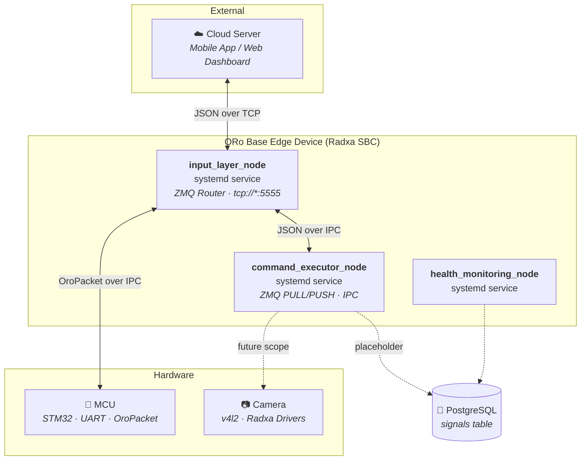
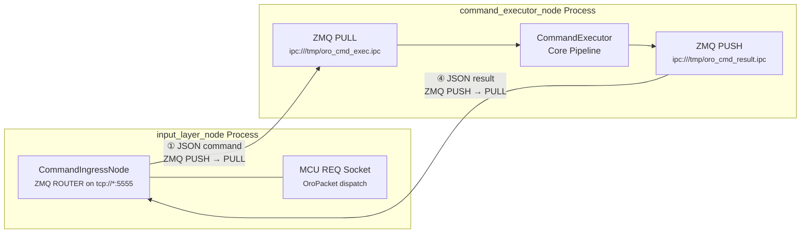
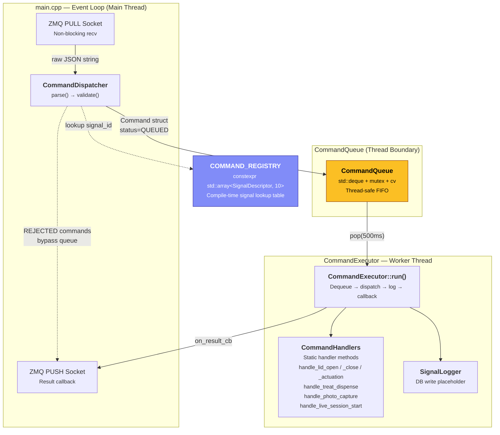
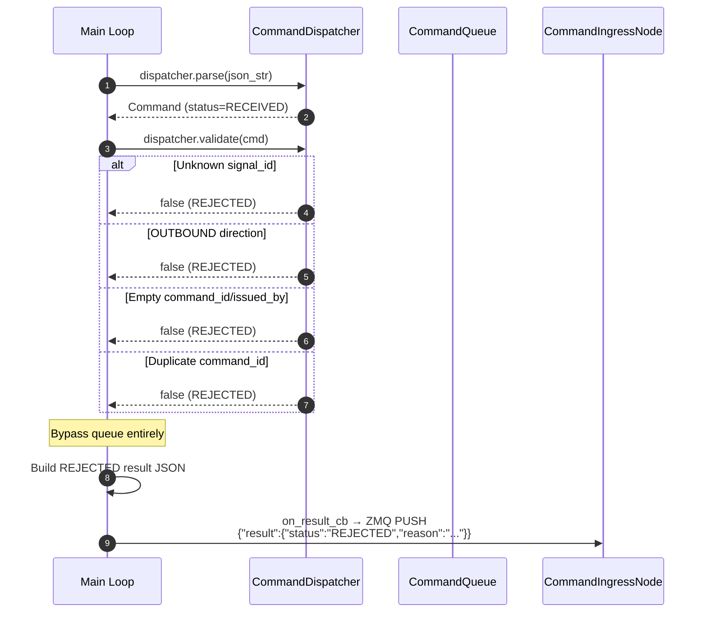

# CommandExecutor

> Lightweight, ZMQ-based C++17 UCES Command Execution Engine for ORo Base Edge.

CommandExecutor is a standalone systemd service that replaces the heavyweight ROS2 Task Management System (`oro_scheduler/oro_core`). It acts as the validated ingress layer for server-initiated commands to edge hardware — managing JSON parsing, signal validation, thread-safe queuing, handler dispatch, database logging, and asynchronous result delivery.

**Version**: 1.0.0  
**Language**: C++17  
**Middleware**: ZeroMQ (IPC sockets)  
**Namespace**: `oro`

---

## Table of Contents

- [Architecture](#architecture)
  - [L0 — System Context](#l0--system-context)
  - [L1 — Container View](#l1--container-view)
  - [L2 — Component View](#l2--component-view)
  - [Swimlane — Command Lifecycle](#swimlane--command-lifecycle)
- [UCES Signal Registry](#uces-signal-registry)
- [JSON Wire Protocol](#json-wire-protocol)
- [Project Structure](#project-structure)
- [Class Reference](#class-reference)
- [Data Model](#data-model)
- [Database Schema](#database-schema)
- [Build & Run](#build--run)
- [Testing](#testing)
- [Deployment](#deployment)

---

## Architecture

### L0 — System Context

The highest-level view. CommandExecutor sits between the cloud/app server and the physical hardware on the ORo Base edge device. It is one of several services running on the Radxa SBC.



**Key Relationships:**
| Actor | Protocol | Role |
|---|---|---|
| Cloud Server | JSON over TCP | Command originator |
| input_layer_node | ZMQ PUSH/PULL over IPC | Gateway / Router |
| command_executor_node | ZMQ PUSH/PULL over IPC | **This package** — command validation, queuing, execution |
| MCU | OroPacket over UART (via input_layer) | Hardware actuators (lids, pump, dispenser) |
| PostgreSQL | libpq (future) | Signal persistence |

---

### L1 — Container View

Zooms into the edge device to show how `command_executor_node` interacts with its immediate neighbors. The two IPC socket pairs form the communication boundary.



**Socket Topology:**

| Socket | Type | Endpoint | Direction | Bound By |
|---|---|---|---|---|
| Command Ingress | PUSH | `ipc:///tmp/oro_cmd_exec.ipc` | `input_layer → command_executor` | `command_executor_node` (bind) |
| Result Egress | PUSH | `ipc:///tmp/oro_cmd_result.ipc` | `command_executor → input_layer` | `command_executor_node` (bind) |

> **Design Note:** `command_executor_node` **binds** both sockets. `input_layer_node` **connects**. This means CommandExecutor can restart independently without disrupting the ingress node's socket lifecycle.

---

### L2 — Component View

The internal architecture of `command_executor_node`. Every box is a concrete C++ class.



**Thread Model:**
| Thread | Owner | Responsibility |
|---|---|---|
| **Main Thread** | `main()` | ZMQ recv loop → parse → validate → enqueue |
| **Worker Thread** | `CommandExecutor::run()` | Dequeue → handler dispatch → DB log → result callback |
| **Detached Thread** | `handle_live_session_start` | Background v4l2 session (future scope) |

---

### Swimlane — Command Lifecycle

End-to-end flow for a single UCES command, from server origin to result delivery.

```mermaid
sequenceDiagram
    autonumber

    participant S as ☁️ Server
    participant CI as CommandIngressNode<br/>(input_layer_node)
    participant ML as Main Loop<br/>(main.cpp)
    participant CD as CommandDispatcher
    participant CQ as CommandQueue
    participant CE as CommandExecutor<br/>(Worker Thread)
    participant CH as CommandHandlers
    participant SL as SignalLogger
    participant DB as 🐘 PostgreSQL

    rect rgb(30, 41, 59)
        Note over S,CI: 1. INGRESS
        S->>CI: JSON command over TCP<br/>{"header":{"signal_id":84,...},"payload":{}}
        CI->>CI: Detect "header" key → UCES routing
        CI->>ML: ZMQ PUSH → PULL<br/>ipc:///tmp/oro_cmd_exec.ipc
    end

    rect rgb(30, 58, 41)
        Note over ML,CD: 2. PARSE & VALIDATE
        ML->>CD: dispatcher.parse(json_str)
        CD->>CD: JSON → Command struct<br/>status = RECEIVED
        CD-->>ML: std::optional<Command>

        ML->>CD: dispatcher.validate(cmd)
        CD->>CD: ① Lookup signal_id in COMMAND_REGISTRY<br/>② Check direction == INBOUND<br/>③ Verify command_id, issued_by present<br/>④ Deduplicate via active_command_ids_
        CD-->>ML: true (status = QUEUED)
    end

    rect rgb(59, 30, 30)
        Note over ML,CQ: 3. ENQUEUE
        ML->>CQ: queue.push(cmd)
        Note right of CQ: Thread-safe FIFO<br/>mutex + condition_variable
    end

    rect rgb(49, 30, 59)
        Note over CQ,SL: 4. EXECUTE
        CE->>CQ: queue.pop(500ms)
        CQ-->>CE: Command (status → DISPATCHING)
        CE->>CH: signal_id switch dispatch<br/>e.g. handle_lid_open(cmd)
        CH-->>CE: CommandResult {success, data}
        CE->>CE: status → COMPLETED or FAILED
        CE->>SL: SignalLogger::log(cmd)
        SL-->>DB: placeholder (commented out INSERT)
    end

    rect rgb(30, 41, 59)
        Note over CE,S: 5. RESPOND
        CE->>ML: on_result_cb(cmd)<br/>→ serialize result JSON
        ML->>CI: ZMQ PUSH → PULL<br/>ipc:///tmp/oro_cmd_result.ipc
        CI->>S: JSON result over TCP<br/>{"header":{...},"result":{"status":"SUCCESS",...}}
    end
```



#### Rejection Path (Validation Failure)

When a command fails validation, it short-circuits the queue entirely:



---

## UCES Signal Registry

All 10 UCES signals are defined at compile time in `command_registry.hpp` as a `constexpr std::array<SignalDescriptor, 10>`.

### Inbound Commands (Server → Edge)

| Signal ID | Signal Type | Value Type | Timeout | Handler |
|:-:|---|:-:|:-:|---|
| **#84** | `manual_lid_open_command_event` | event | 3000ms | `handle_lid_open` |
| **#123** | `manual_lid_close_command_event` | event | 3000ms | `handle_lid_close` |
| **#64** | `lid_actuation_command` | enum | 3000ms | `handle_lid_actuation` |
| **#85** | `treat_dispense_command_event` | event | 5000ms | `handle_treat_dispense` |
| **#91** | `photo_capture_command_event` | event | 5000ms | `handle_photo_capture` |
| **#88** | `live_session_start_event` | event | 10000ms | `handle_live_session_start` |

### Outbound Results (Edge → Server)

| Signal ID | Signal Type | Value Type | Emitted By |
|:-:|---|:-:|---|
| **#65** | `lid_actuation_result` | enum | Lid handlers |
| **#125** | `treat_dispensed_quantity` | numeric | Treat handler (returns +ve int) |
| **#126** | `treat_dispense_confirmation` | boolean | Treat handler |
| **#93** | `image_file_save_confirmation` | boolean | TBD |

---

## JSON Wire Protocol

### Inbound Command

```json
{
  "header": {
    "signal_id": 84,
    "signal_type": "manual_lid_open_command_event",
    "command_id": "cmd_1001",
    "source": "UCES",
    "issued_by": "mobile_app",
    "event_time": 1714543200
  },
  "payload": {}
}
```

### Inbound Command with Parameters

```json
{
  "header": {
    "signal_id": 64,
    "signal_type": "lid_actuation_command",
    "command_id": "cmd_1003",
    "source": "UCES",
    "issued_by": "user_dashboard",
    "event_time": 1714543200
  },
  "payload": {
    "lid_id": 1,
    "action": "OPEN"
  }
}
```

### Outbound Result

```json
{
  "header": {
    "signal_id": 84,
    "signal_type": "manual_lid_open_command_event",
    "command_id": "cmd_1001",
    "source": "UCES"
  },
  "result": {
    "status": "SUCCESS",
    "completion_time": 1714543205
  }
}
```

### Rejection Result

```json
{
  "header": {
    "signal_id": 999,
    "signal_type": "nonexistent",
    "command_id": "cmd_bad",
    "source": "UCES"
  },
  "result": {
    "status": "REJECTED",
    "reason": "Validation failed"
  }
}
```

---

## Project Structure

```
command_executor/
├── CMakeLists.txt                           # C++17, libzmq, Threads
├── command_executor.service                 # systemd unit file
├── README.md                                # This document
│
├── include/command_executor/
│   ├── command.hpp                          # Command struct, CommandStatus, enums
│   ├── command_registry.hpp                 # constexpr COMMAND_REGISTRY (10 signals)
│   ├── command_queue.hpp                    # Thread-safe FIFO (deque + mutex + cv)
│   ├── command_dispatcher.hpp               # parse() + validate()
│   ├── command_executor.hpp                 # Worker thread lifecycle
│   ├── command_handlers.hpp                 # Handler function declarations
│   └── signal_logger.hpp                    # DB write interface
│
├── src/
│   ├── main.cpp                             # Entry point, ZMQ sockets, event loop
│   ├── command_dispatcher.cpp               # JSON parsing + 4-stage validation
│   ├── command_executor.cpp                 # Worker thread, handler dispatch switch
│   ├── command_handlers.cpp                 # 6 stub handler implementations
│   └── signal_logger.cpp                    # Placeholder with commented SQL
│
└── tests/
    ├── run_tests.sh                         # Build → Launch → Test → Teardown
    └── test_command_executor.py             # 18 integration tests (pyzmq)
```

---

## Class Reference

### `Command` — Data Model
Flat POD struct carrying the full lifecycle of a single command.

| Field | Type | Description |
|---|---|---|
| `signal_id` | `uint16_t` | UCES signal identifier |
| `signal_type` | `std::string` | Canonical signal name |
| `command_id` | `std::string` | Unique command instance ID |
| `issued_by` | `std::string` | Originator identity |
| `event_time` | `int64_t` | Unix timestamp of command issuance |
| `status` | `CommandStatus` | Current lifecycle state |
| `payload` | `nlohmann::json` | Signal-specific parameters |
| `result` | `nlohmann::json` | Execution result (populated post-dispatch) |
| `received_at` | `steady_clock::time_point` | Local monotonic receive time |
| `completed_at` | `steady_clock::time_point` | Local monotonic completion time |

### `CommandStatus` — Lifecycle States

```
RECEIVED → QUEUED → DISPATCHING → COMPLETED
                                → FAILED
                                → TIMEOUT
         → REJECTED (bypass queue)
```

### `CommandDispatcher`
- **`parse(json_str)`** — Deserializes JSON into `Command`. Returns `std::nullopt` on malformed input.
- **`validate(cmd)`** — Four-stage gate:
  1. Signal ID exists in `COMMAND_REGISTRY`
  2. Direction is `INBOUND`
  3. `command_id` and `issued_by` are non-empty
  4. `command_id` is not a duplicate

### `CommandQueue`
Thread-safe FIFO backed by `std::deque<Command>` + `std::mutex` + `std::condition_variable`.
- **`push(cmd)`** — Enqueue from main thread, notifies worker.
- **`pop(timeout)`** — Blocking dequeue with configurable timeout (default 500ms).

### `CommandExecutor`
Owns the worker thread. Dequeues commands, dispatches to `CommandHandlers`, logs via `SignalLogger`, and fires the result callback.

### `CommandHandlers`
Static dispatch methods. All currently return stub/dummy results:
- `handle_lid_open` / `handle_lid_close` / `handle_lid_actuation` → `{"status":"SUCCESS"}`
- `handle_treat_dispense` → `{"status":"SUCCESS","treats_dispensed":3}`
- `handle_photo_capture` → `{"status":"SUCCESS"}`
- `handle_live_session_start` → Spawns detached background thread, returns `{"status":"SUCCESS"}`

### `SignalLogger`
Placeholder for PostgreSQL writes. The `INSERT` statement is written but **commented out** pending DB connection utility availability.

---

## Database Schema

Target table: `public.signals`

```sql
CREATE TABLE public.signals (
    id                    BIGSERIAL PRIMARY KEY,
    device_id             UUID NOT NULL,
    dog_id                UUID,
    signal_type           TEXT NOT NULL,
    signal_value_numeric  NUMERIC,
    signal_value_text     TEXT,
    signal_value_boolean  BOOLEAN,
    unit                  TEXT,
    observed_at           TIMESTAMPTZ NOT NULL,
    ingested_at           TIMESTAMPTZ,
    source                TEXT,
    confidence            NUMERIC(5,2),
    metadata              JSONB,
    created_at            TIMESTAMPTZ DEFAULT CURRENT_TIMESTAMP
);
```

---

## Build & Run

### Prerequisites

- GCC 11+ or Clang 14+ with C++17 support
- libzmq (`sudo apt install libzmq3-dev`)
- nlohmann-json (`sudo apt install nlohmann-json3-dev`)

### Build

```bash
cd /home/ogmen/oro_base/oro_base_edge_layer/command_executor
mkdir -p build && cd build
cmake .. && make -j$(nproc)
```

### Run (Standalone)

```bash
./build/command_executor_node
```

Requires `input_layer_node` to be running for end-to-end command flow.

---

## Testing

### Automated Test Suite

```bash
# One-command: build, launch, test, teardown
bash tests/run_tests.sh
```

The test suite (`tests/test_command_executor.py`) contains **18 integration tests** across 4 categories:

| Category | Tests | Coverage |
|---|---|---|
| **Valid Commands** | 6 | All INBOUND handlers return SUCCESS |
| **Validation** | 7 | Unknown IDs, OUTBOUND rejection, missing fields, duplicates, malformed JSON, missing header |
| **Burst Queue** | 2 | 5 simultaneous commands, 10 mixed signals |
| **Response Structure** | 3 | Header/result keys, field completeness, treat dispense payload |

---

## Deployment

### systemd Service

```ini
# /etc/systemd/system/command_executor.service
[Unit]
Description=ORo CommandExecutor Service
After=input_layer_node.service
Requires=input_layer_node.service

[Service]
Type=simple
ExecStart=/home/ogmen/oro_base/oro_base_edge_layer/command_executor/build/command_executor_node
Restart=on-failure
RestartSec=3

[Install]
WantedBy=multi-user.target
```

### Install & Enable

```bash
sudo cp command_executor.service /etc/systemd/system/
sudo systemctl daemon-reload
sudo systemctl enable command_executor
sudo systemctl start command_executor
```

### Boot Order

```
1. input_layer_node.service    (binds tcp://*:5555, connects IPC)
2. command_executor.service    (binds IPC, starts worker thread)
3. health_monitoring_node      (subscribes to ZMQ sensor topics)
```
