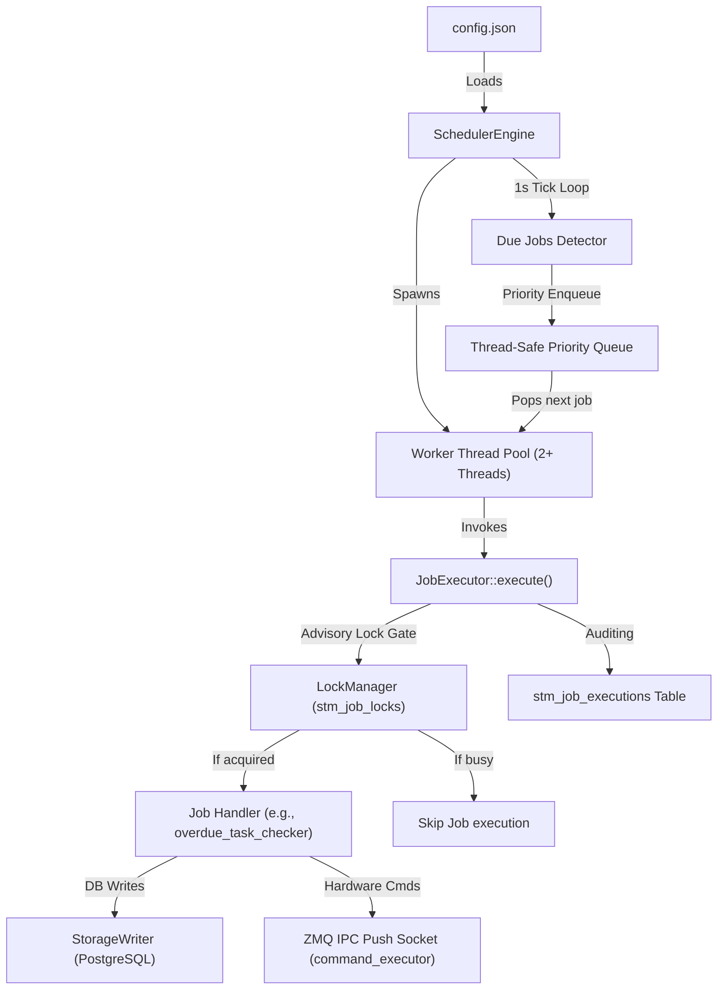
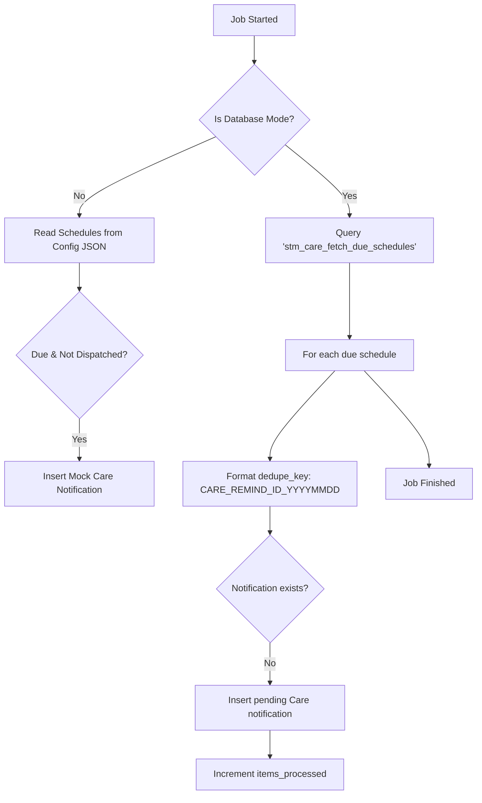

# Scheduled Task Manager — Jobs Architecture, Validation, & Developer Guide

This document provides a comprehensive guide for all scheduled jobs in the Scheduled Task Manager (STM) daemon. It details the intent of each job, execution flows, validation methodologies, database inspection commands, and pending development roadmaps.

---

## 1. Daemon Architecture Overview

The Scheduled Task Manager runs as a multi-threaded C++ daemon that coordinates periodic background tasks for the ORO pet care edge platform.



### Core Mechanisms
1. **Concurrency Control**: A database-backed advisory locking mechanism (`stm_job_locks`) ensures that only one device/worker executes a job at any given time, preventing duplication in horizontal scaling.
2. **Priority Execution**: Jobs are enqueued into a priority queue sorted by severity: `CRITICAL > HIGH > MEDIUM > LOW`.
3. **Audit Log**: Every job execution (including skips, timeouts, failures, and items processed) is logged to `stm_job_executions`.
4. **Timezone Awareness**: The `StorageWriter` maintains connection-level timezones (using `SET timezone`) to align time-based SQL operations with the user's localized configurations.

---

## 2. Deep Dive: The Three Active Core Jobs

This section provides a granular, technical breakdown of the three active core jobs running in production.

---

### Job 1: `care_reminder_dispatch`
*   **Source File**: `care_jobs.cpp`
*   **Job Name**: `care_reminder_dispatch`
*   **Category**: `REMINDER` (Priority: `HIGH`)
*   **Default Interval**: `60` seconds

#### Logical Flow


#### Database Queries Involved

1.  **Fetching Due Care Schedules (`stm_care_fetch_due_schedules`)**:
    *   **Intent**: Selects active care tasks that are scheduled within the current minute range (localized time) and have not yet been completed today or notified.
    *   **Query**:
        ```sql
        SELECT c.care_schedule_id, c.dog_id, c.device_id, c.care_type, c.title, c.description, c.created_by_user_id
        FROM oro_base_care_schedules c
        WHERE c.is_active = true 
          AND c.device_id = $1::uuid
          AND (c.scheduled_time IS NULL OR c.scheduled_time BETWEEN (CURRENT_TIME - INTERVAL '1 minute') AND CURRENT_TIME)
          AND (
            (c.recurrence_type = 'one_time' AND c.due_date = CURRENT_DATE)
            OR (c.recurrence_type = 'daily')
            OR (c.recurrence_type = 'weekly' AND (c.recurrence_days ? LOWER(TRIM(TO_CHAR(CURRENT_DATE, 'Day')))))
            OR (c.recurrence_type = 'monthly' AND EXTRACT(DAY FROM c.start_date) = EXTRACT(DAY FROM CURRENT_DATE))
          )
          AND (c.last_completed_at IS NULL OR c.last_completed_at::date < CURRENT_DATE)
          AND NOT EXISTS (
              SELECT 1 FROM oro_base_notifications n
              WHERE n.dedupe_key = 'CARE_REMIND_' || c.care_schedule_id || '_' || TO_CHAR(CURRENT_DATE, 'YYYYMMDD')
          );
        ```

2.  **Inserting Notification Alert (`stm_care_insert_notification`)**:
    *   **Query**:
        ```sql
        INSERT INTO oro_base_notifications 
          (device_id, dog_id, sender_id, category, event_type, title, message, priority, status, payload, dedupe_key, created_at, updated_at)
        VALUES 
          ($1::uuid, $2::uuid, NULL, 'Care', 'care_reminder', $3, $4, 'medium', 'pending', $5::jsonb, $6, NOW(), NOW());
        ```

#### Sample Generated Notification Payload
*   **Deduplication Key**: `CARE_REMIND_c9111e24-fcc2-469e-beb9-b6d553e9da3b_20260608`
*   **Payload JSON**:
    ```json
    {
      "care_schedule_id": "c9111e24-fcc2-469e-beb9-b6d553e9da3b",
      "care_type": "medication",
      "dispatch_method": "scheduled_task_manager"
    }
    ```

---

### Job 2: `overdue_task_checker`
*   **Source File**: `care_jobs.cpp`
*   **Job Name**: `overdue_task_checker`
*   **Category**: `REMINDER` (Priority: `HIGH`)
*   **Default Interval**: `900` seconds (15 minutes)

#### Logical Flow
```mermaid
flowchart TD
    Start[Job Started] --> SetTZ[Set Session Timezone to Configured TZ]
    SetTZ --> ReadGrace[Read grace_period_minutes from Config]
    
    ReadGrace --> CheckFeeding[Check Overdue Feeding Schedules]
    CheckFeeding -->|Found| EmitFeedNotif[Emit High-Priority Notification & Event]
    
    EmitFeedNotif --> CheckCare[Check Overdue Care Schedules]
    CheckCare -->|Found| EmitCareNotif[Emit High-Priority Notification & Event]
    
    EmitCareNotif --> LogMetrics[Write structured [METRIC] log & record to stm_job_executions]
    LogMetrics --> Done[Job Finished]
```

#### Database Queries Involved

1.  **Checking Overdue Feeding Tasks (`stm_care_emit_overdue_feeding_notification`)**:
    *   **Intent**: Identifies feeding schedules where the current local time has surpassed the scheduled feeding time plus the configured grace period, and no feeding event has been recorded for the day. Inserts high-priority notifications.
    *   **Query**:
        ```sql
        INSERT INTO oro_base_notifications 
          (device_id, dog_id, category, event_type, title, message, priority, status, payload, dedupe_key, created_at, updated_at)
        SELECT 
          f.device_id, f.dog_id, 'Care', 'feeding_overdue', 'Feeding Overdue',
          'Feeding schedule ' || f.meal_name || ' was due at ' || f.scheduled_time || ' but has not been marked complete.',
          'high', 'pending',
          jsonb_build_object('feeding_schedule_id', f.feeding_schedule_id, 'meal_name', f.meal_name, 'scheduled_time', f.scheduled_time),
          'FEED_OVERDUE_' || f.feeding_schedule_id || '_' || TO_CHAR(CURRENT_DATE, 'YYYYMMDD'),
          NOW(), NOW()
        FROM oro_base_feeding_schedules f
        WHERE f.device_id = $1::uuid AND f.is_active = true
          AND f.scheduled_time < (CURRENT_TIME - INTERVAL '15 minutes')
          AND NOT EXISTS (
              SELECT 1 FROM oro_base_meals m
              WHERE m.feeding_schedule_id = f.feeding_schedule_id 
                AND m.fed_at::date = CURRENT_DATE
          )
          AND NOT EXISTS (
              SELECT 1 FROM oro_base_notifications n
              WHERE n.dedupe_key = 'FEED_OVERDUE_' || f.feeding_schedule_id || '_' || TO_CHAR(CURRENT_DATE, 'YYYYMMDD')
          );
        ```

2.  **Checking Overdue Care Tasks (`stm_care_emit_overdue_care_notification`)**:
    *   **Intent**: Checks standard care tasks (grooming, medications, etc.) scheduled for today or earlier that remain incomplete past the grace period. Inserts high-priority notifications.
    *   **Query**:
        ```sql
        INSERT INTO oro_base_notifications 
          (device_id, dog_id, category, event_type, title, message, priority, status, payload, dedupe_key, created_at, updated_at)
        SELECT 
          c.device_id, c.dog_id, 'Care', 'care_task_overdue', 'Care Task Overdue',
          'Care task ' || c.title || ' is overdue.',
          'high', 'pending',
          jsonb_build_object('care_schedule_id', c.care_schedule_id, 'title', c.title, 'scheduled_time', c.scheduled_time),
          'CARE_OVERDUE_' || c.care_schedule_id || '_' || TO_CHAR(CURRENT_DATE, 'YYYYMMDD'),
          NOW(), NOW()
        FROM oro_base_care_schedules c
        WHERE c.device_id = $1::uuid AND c.is_active = true
          AND (
            (c.due_date IS NOT NULL AND c.due_date < CURRENT_DATE)
            OR
            (c.scheduled_time IS NOT NULL AND c.scheduled_time < (CURRENT_TIME - INTERVAL '15 minutes'))
          )
          AND (c.last_completed_at IS NULL OR c.last_completed_at::date < CURRENT_DATE)
          AND NOT EXISTS (
              SELECT 1 FROM oro_base_notifications n
              WHERE n.dedupe_key = 'CARE_OVERDUE_' || c.care_schedule_id || '_' || TO_CHAR(CURRENT_DATE, 'YYYYMMDD')
          );
        ```

3.  **Emitting Overdue Status Event (`stm_care_emit_event`)**:
    *   **Intent**: Records an event log in `oro_base_events` for audit history and telemetry.
    *   **Query**:
        ```sql
        INSERT INTO oro_base_events 
          (device_id, dog_id, event_type, category, event_source, severity, status, trigger_mode, detected_at, event_start_at, title, description, payload, dedupe_key, notification_eligible, created_at, updated_at)
        VALUES 
          ($1::uuid, $2::uuid, $3, 'Care', 'scheduled_task_manager', $4, 'open', 'scheduled', NOW(), NOW(), $5, $6, $7::jsonb, $8, true, NOW(), NOW());
        ```

---

### Job 3: `device_health_check`
*   **Source File**: `device_jobs.cpp`
*   **Job Name**: `device_health_check`
*   **Category**: `DEVICE` (Priority: `CRITICAL`)
*   **Default Interval**: `300` seconds (5 minutes)

#### Diagnostic Checklist & Logic
`device_health_check` runs multiple diagnostics in a single execution block:

```
[device_health_check Executed]
 ├── Check 1: Connectivity (Heartbeat age vs communication_timeout_threshold)
 ├── Check 2: Power (Latest battery_level signal vs battery_low_threshold)
 ├── Check 3: Water Level (water_refill_required status signal)
 ├── Check 4: Status Fields (oro_base_device.status = 'error')
 └── Check 5: Sensor Freshness (Checks time since last signal for:
                 - food_bowl_weight    - water_bowl_level    - ambient_temp
                 - environment_temp    - ambient_humidity    - ambient_light)
```

#### Key Database Queries Involved

1.  **Reading Sensor Staleness (`stm_sensor_freshness_minutes`)**:
    *   **Query**:
        ```sql
        SELECT COALESCE(EXTRACT(EPOCH FROM (NOW() - MAX(observed_at))) / 60.0, 9999.0)
        FROM oro_base_signals
        WHERE device_id = $1::uuid AND signal_type = $2;
        ```

2.  **Inserting Device Alert Events (`stm_device_emit_event`)**:
    *   **Query**:
        ```sql
        INSERT INTO oro_base_events 
          (device_id, dog_id, event_type, category, event_source, severity, status, trigger_mode, detected_at, event_start_at, title, description, payload, dedupe_key, notification_eligible, created_at, updated_at)
        VALUES 
          ($1::uuid, NULL, $2, 'Device Health', 'scheduled_task_manager', $3, 'open', 'scheduled', NOW(), NOW(), $4, $5, $6::jsonb, $7, true, NOW(), NOW());
        ```

3.  **Deduplication Keys used**:
    *   *Heartbeat Offline*: `STM_NOTIF_OFFLINE_[device_id]`
    *   *Low Battery*: `STM_NOTIF_BATTERY_[device_id]`
    *   *Water Tank Empty*: `STM_NOTIF_LOW_SUPPLY_[device_id]`
    *   *Hardware Error*: `STM_NOTIF_ERROR_[device_id]`
    *   *Stale Sensor*: `STM_NOTIF_STALE_[sensor_type]_[device_id]`

---

### Category C: Secondary Active Jobs (Currently Inactive/Commented)

*   **`sensor_data_freshness_check`** (`device_jobs.cpp`): A standalone dedicated job that executes the same stale telemetry sensor checks as Job 3, but is configured to run at a lower frequency (`600` seconds) and is disabled by default in `/home/radxa/oro_base/oro_base_edge_layer/config/oro_base_edge_layer_config.json`.

---

## 3. Test & Validation Methodologies

To test jobs during local development, modify the `/home/radxa/oro_base/oro_base_edge_layer/config/oro_base_edge_layer_config.json` parameters.

### Fast validation setup (30-second triggers)
1. **Edit Config**: Shorten the desired job interval:
   ```json
   "overdue_task_checker": {
       "interval_seconds": 30,
       "enabled": true,
       "grace_period_minutes": 15
   }
   ```
2. **Execute Daemon**:
   ```bash
   /home/radxa/oro_base/oro_base_edge_layer/scheduled_task_manager/build/scheduled_task_manager_node
   ```
3. **Verify Execution**: Observe the logger output. It should output job status, database locks, and processed counts:
   ```
   [SchedulerEngine] Enqueueing due job 'overdue_task_checker' (Priority: HIGH)
   [LockManager] Acquired lock for 'overdue_task_checker' (TTL: 45s)
   [CareJobs] overdue_task_checker executing...
   [CareJobs] [METRIC] overdue_task_checker overdue_feeding=1 overdue_care=5 grace_minutes=15 tz=Asia/Kolkata total_items=6
   [LockManager] Released lock for 'overdue_task_checker'
   ```

---

## 4. Useful PostgreSQL Verification Queries

Use the following statements in `psql` to check database state and job outputs:

### Inspect Audit Logs
```sql
SELECT execution_id, job_name, status, duration_ms, items_processed, error, metadata, started_at
FROM stm_job_executions
ORDER BY started_at DESC
LIMIT 10;
```

### Inspect Generated Alerts
```sql
SELECT notification_id, category, title, priority, status, dedupe_key, created_at
FROM oro_base_notifications
WHERE dedupe_key LIKE '%OVERDUE%' OR dedupe_key LIKE '%BATTERY%' OR dedupe_key LIKE '%OFFLINE%'
ORDER BY created_at DESC;
```

### Inspect Open Events
```sql
SELECT event_id, event_type, category, severity, status, title, payload, created_at
FROM oro_base_events
WHERE status = 'open'
ORDER BY created_at DESC;
```

---

## 5. Development Roadmaps & TODO Checklist

### Overdue Task Checker: Option A (Production Schema Migration)
We are currently using **Option B** (tracking overdue tasks via events only). For a production rollout, follow the Option A pattern outlined in `care_jobs.cpp`:

1. **Database Migration**: Run DDL to add a persistent `status` column:
   ```sql
   ALTER TABLE oro_base_care_schedules ADD COLUMN status TEXT NOT NULL DEFAULT 'pending';
   ALTER TABLE oro_base_feeding_schedules ADD COLUMN status TEXT NOT NULL DEFAULT 'pending';
   ```
2. **Status Updates**: Uncomment the UPDATE queries in `care_jobs.cpp` under the `// TODO: [Option A]` comments. This ensures schedules transition directly to `'overdue'` status, acting as a single source of truth for the API and frontend.
3. **Daily EOD Reset**: Add a EOD trigger to set overdue statuses back to `'pending'` for daily recurring tasks.

### Infrastructure Stubs
*   **`failed_sync_retry`**: Requires SQLite connection logic in `storage_handoff` to read, upload to cloud bridge, and pop entries from `sync_queue.db`.
*   **`data_cleanup`**: Requires filesystem prune routines (using C++17 `<filesystem>`) combined with DB `DELETE` queries matching `config["scheduled_task_manager"]["retention_days"]`.
